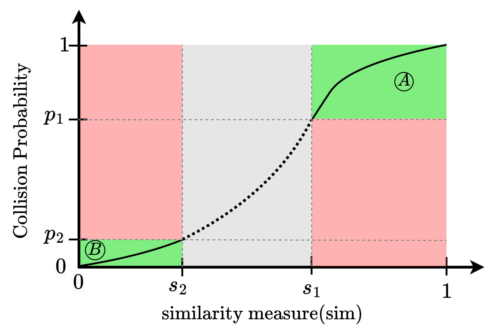

:orphan:

.. _hashfunctionshashfamilyandLSH:

Hash Function, Hash Family and Locality Sensitive Hashing
=========================================================

Here, we formally define Hash function, Hash family and Locality Sensitive Hashing.

A **hash function** :math:`(h_{\theta})` takes an element from a universe :math:`U` and maps it to one of :math:`B` buckets, where :math:`\theta` is a randomly drawn seed from seed space :math:`\Theta` that determines the behaviour the hash function. Varying :math:`\theta` across all possible values of :math:`\Theta`, yields us a collection of hash functions which we term as the **hash family**, :math:`\mathcal{H} = \{h_\theta \mid \theta \in \Theta \}`. We do not analyze a particular hash function in isolation, rather we analyze randomly sampled hash functions from the hash family. This gives us the performance in probabilistic sense over the entire family.

In **Locality Sensitive Hashing**, the hash family is designed in such a way that elements in :math:`U` that are similar to each other, have a higher probability of being mapped to the same bucket than those which are dissimilar. This property makes these hash functions useful in situations where we need to implement similarity search, clustering, etc.

To put it formally, a family of hash functions :math:`\mathcal{H}` is said to be :math:`(s_1,s_2,p_1,p_2)`-sensitive, with :math:`s_1 \geq s_2` and :math:`p_1 \geq p_2`, if for all :math:`x,y \in U`,

.. math::

   sim(x,y) \geq s_1 \;\Longrightarrow\; \Pr_{h_\theta \in\mathcal{H}}\!\big[h_\theta(x)=h_\theta(y)\big]\;\geq\; p_1 

.. math::

   sim(x,y) \leq s_2 \;\Longrightarrow\; \Pr_{h_\theta \in \mathcal{H}}\!\big[h_\theta(x)=h_\theta(y)\big] \;\leq\; p_2

Here, :math:`\Pr_{h_\theta \in \mathcal{H}}` defined as the probability space where :math:`\theta` is chosen uniformly at random from :math:`\Theta` to get :math:`h_\theta`.

   Collision Curve

Based on the above two equations we describe two useful versions of LSH. First, if the thresholds strictly satisfy :math:`s_1 > s_2`, the family is termed *gapped*-LSH since the collision guarantees apply only to the disjoint low similarity :math:`[0,s_2]` and the high similarity :math:`[s_1,1]` regions, leaving an interval :math:`(s_2,s_1)` in between where no guarantee holds. A special case occurs when :math:`\mathcal{H}` is :math:`(s,s,s,s)`-sensitive for all :math:`s \in (0,1)`, in which case the collision probability equals the similarity itself and thus termed as a *similarity*-estimator. 
This is equivalent to saying that for all :math:`x, y \in U`,

.. math::

   \Pr_{h_\theta \in \mathcal{H}}[h_\theta(x)=h_\theta(y)] = sim(x,y)

The above equation is represented by the curve 2 in the figure above.

Efficiency Parameter :math:`\rho`
~~~~~~~~~~~~~~~~~~~~~~~~~~~~~~~~~~
From the collision curves, one can quantify a hash family's discriminative power via the efficiency parameter which is given by:

.. math::

   \rho = \frac{\ln(p_1)}{\ln(p_2)}.

A lower :math:`\rho` is preferable: it reflects a large gap between :math:`p_1` and :math:`p_2`, meaning the scheme reliably collides near neighbours while separating far ones. For a fixed pair :math:`(s_1, s_2)`, the collision curve plots produced by the benchmark allow direct comparison of :math:`\rho` across hash families, giving a single, interpretable scalar for ranking their suitability under the mutation model and distance metric in use. Note that just the :math:`\rho` value is not sufficient to compare the hash function computational efficiency. 

