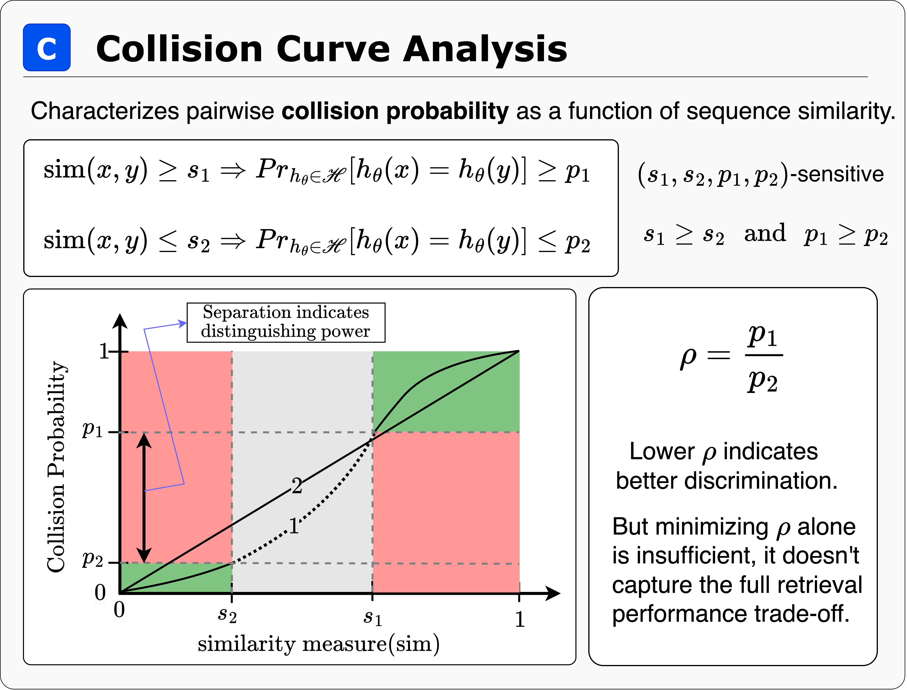
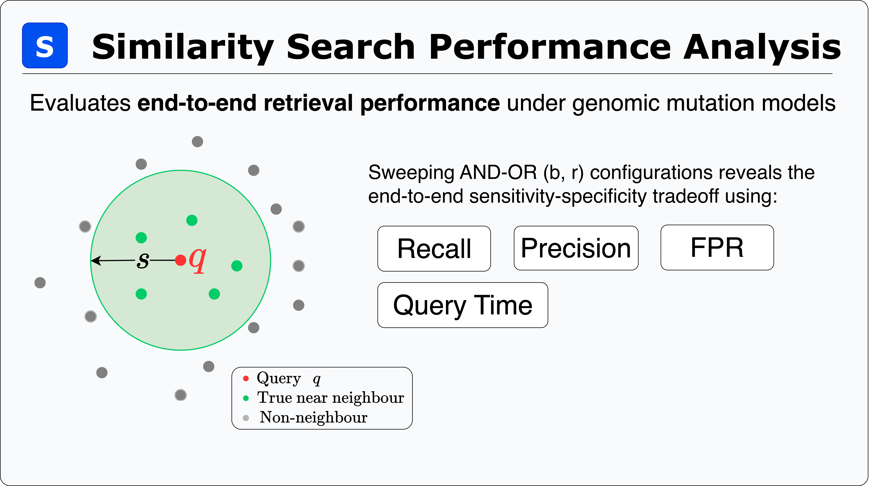

Available Tests
===============================================
BioLSHasher currently supports two tests for evaluating candidate LSH functions in the context of DNA sequences and genomic mutations. The two tests are Collision Curve Analysis and Threshold Based Similarity Search Performance Evaluation. Both these tests target a different aspect of the Hash Function under test. Below we give a concise description of the tests. 

.. note::
	For a brief introduction to relevant definitions, please refer to :doc:`Hash Functions, Hash Family and Locality Sensitive Hashing <hashfunctionHashfamilyandLSH>`.

1. Collision Curve Analysis
---------------------------

Collision curve analysis characterizes the relationship between pairwise sequence similarity and the empirical probability of hash collision. A well-behaved LSH family should exhibit a monotonically increasing collision probability between two inputs as the similarity between them increases. 

This test reports empirical collision rates stratified across similarity bins, together with their variance across independent trials, for each hash family under evaluation. This stratified collision probability values serves as the primary(and first) view for whether a given LSH scheme preserves the locality property under the mutation models and distance metrics used in the benchmark. Additionally, collision curve test also gives the :math:`\rho` value for a given :math:`s_1` and :math:`s_2` which represents the computational efficiency of the hash function. A lower :math:`\rho` represents higher computational efficiency. 
(See :ref:`rho_value` for more details.)

   Overview of Collision Curve Analysis

2. Threshold Based Similarity Search Performance Evaluation
-----------------------------------------------------------
Threshold-based similarity search performance evaluation moves beyond the per-pair view of the collision curve to assess **end-to-end retrieval quality** under a realistic search scenario. 

Given a query sequence :math:`q` and a similarity threshold :math:`s`, the task here is to retrieve all database sequences that fall within that threshold (the true near neighbours), while excluding those that do not. The benchmark sweeps over AND-OR amplification configurations :math:`(b, r)`, i.e., varying the number of bands :math:`b` and hash functions per band :math:`r`, and reports Recall, Precision, False Positive Rate
(FPR), and Query Time at each configuration. This reveals the full sensitivity and specificity tradeoff patterns, showing how aggressively a hash family can be amplified for recall before precision degrades or query cost becomes prohibitive.

.. This test is important because a hash family that looks well-behaved on the collision curve may still perform poorly in practice: AND-OR amplification is highly sensitive to the exact values of :math:`p_1` and :math:`p_2`. A hash family whose collision probabilities are only modestly separated will see its amplified recall :math:`P_1 = 1-(1-p_1^r)^b` collapse as
.. the band depth :math:`r` grows, while an insufficiently small :math:`p_2` causes the amplified false positive rate :math:`P_2 = 1-(1-p_2^r)^b` to remain unacceptably high across all :math:`(b, r)` configurations.

By evaluating directly on labelled query-neighbour pairs generated under the configured mutation model, this test grounds the abstract LSH guarantees in empirical retrieval metrics(Recall, Precision, FPR, Query Time), giving the user a complete picture of whether a candidate hash family is suitable for deployment.

   Overview of Similarity Search Performance Analysis

